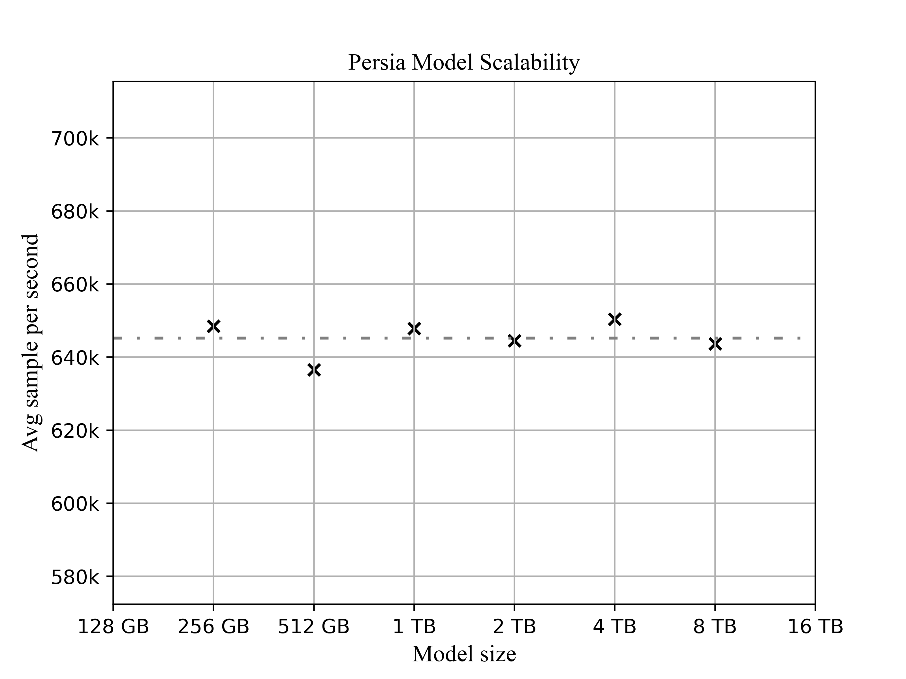

Benchmark
======

## Setup

We use up to 4 GPU servers and 16 CPU servers for benchmarks. Each GPU server is equipped with 8 NVIDIA V100 32GB GPUs interconnected by NVLink, connected by 100 Gbps TCP/IP network. Each CPU server is equipped with 64 core `Intel(R) Xeon(R) Gold 5218 CPU@2.30GHz`, connected by 10 Gbps TCP/IP network.

We compare the performance of Persia with [PaddlePaddle](https://github.com/PaddlePaddle/Paddle) and [x-deepleaning](https://github.com/alibaba/x-deeplearning) on a DNN model. The DNN model adapted the embedding and MLP paradigm which has been widely used by industrial recommender systems, e.g. [DNN for Youtube](https://dl.acm.org/doi/10.1145/2959100.2959190), [Wide & Deep](https://dl.acm.org/doi/abs/10.1145/2988450.2988454) and [Deep Crossing](https://dl.acm.org/doi/10.1145/2939672.2939704). The DNN model consists of four parts, embedding layer, concat layer, MLP layer, `cross_entropy` loss. The embedding size of all sparse features are set to 16. The MLP layer is 6 fully connected layers with hidden size `[4096, 2048, 1024, 512, 256]`.

We conducted experiments on three datasets, including [Criteo](https://www.kaggle.com/c/criteo-display-ad-challenge), [Avazu CTR](https://www.kaggle.com/c/avazu-ctr-prediction) and [Alibaba AD](https://www.kaggle.com/pavansanagapati/ad-displayclick-data-on-taobaocom).

## End-to-end performance

We compared the end-to-end performance of Persia, PaddlePaddle and x-deeplearning in terms of test AUC. The same DNN model was trained and validated on the three datasets as described above and all trainings were performed by 8 GPUs. The following figure shows the AUC with respect to the number of training samples when training was performed by different frameworks. The figure demonstrates that Persia's hybrid training mode converges to a higher AUC than both PaddlePaddle and x-deeplearning in asynchronous training mode, and has almost the same performance as the x-deepleaning's synchronous training mode.

## Scalability: number of workers

The following figure shows the rank scalability of three datasets when using 1,2,4,8 GPU.

Results show that Persia can achieve obvious speedup compared with other systems, whether it is in synchronous or asynchronous mode. Moreover, the results also show Persia can achieve nearly linear scalability ([without nccl p2p](https://docs.nvidia.com/deeplearning/nccl/user-guide/docs/env.html#nccl-p2p-disable)). Since Persia does not transfer the parameters of the dense part in case of a single GPU, we use the dashed box to indicate its actual training efficiency in this case.

## Scalability: size of model

The figure above demonstrates the model size scalability of Persia. The size of the sparse model hardly affects the training speed of Persia.
