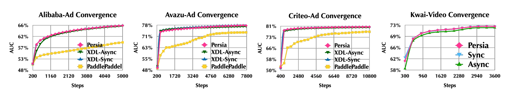
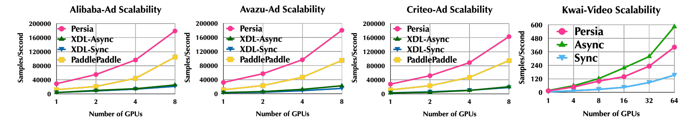
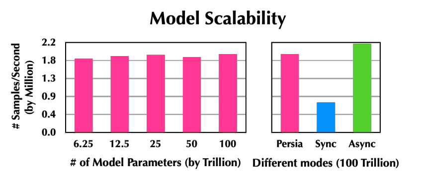

Benchmark
======

We perform a series of large-scale training experiments to demonstrate the scalability and speed of Persia on open-source benchmarks as well as production recommendation workflows. Comparing to SOTA recommender systems, Persia provides significant boost to end-to-end training time, provide high training throughput and scale out well up to trillion-parameter scale models. 

## Setup

### Benchmark Dataset
We evaluate Persia over three open-source benchmarks and one real-world production microvideo recommendation workflow at Kwai:

* [Taobao-Ad](https://www.kaggle.com/pavansanagapati/ad-displayclick-data-on-taobaocom): predict the advertisement CTR from Taobao’s website for 8 days with 26 million records.
* [Avazu-Ad](https://www.kaggle.com/c/avazu-ctr-prediction): predict the advertisement CTR of Avazu’s log for 11 days with 32 million records.
* [Criteo-Ad](https://www.kaggle.com/c/criteo-display-ad-challenge): predict the advertisement CTR of Criteo’s traffic for 24 days with 44 million records.
* Kwai-Video(confidential production dataset): predict the explicit behavior of Kwai’s active users about the microvideo recommendation in 7 days with 3 billion records.

For the three open source advertisement CTR benchmarks, we include 80% of the records as training set and the rest 20% of the records as test set. We consider a fully connected feed forward neural network (FFNN) as the deep learning model with five hidden layer dimensions of 4096, 2048, 1024, 512 and 256. For the Kwai production microvideo recommendation task, 85% of the data are included in the training set while the rest 15% are considered as the test set. We also use FFNN as the model to predict multiple user behaviors.

### Baseline

We consider two state-of-the-art baselines: [XDL](https://github.com/alibaba/x-deeplearning) and [PaddlePaddle](https://github.com/PaddlePaddle/Paddle). XDL is a specialized distributed recommendation framework developed by Alibaba. PaddlePaddle is a general purpose deep learning framework from Baidu with a special Heter mode that implements the design of [AIBox](http://research.baidu.com/Public/uploads/5e18a1017a7a0.pdf), Baidu’s recommendation training system. [^1]

[^1]: According to private communications we had with members of the PaddlePaddle development community.

### Cluster Setup

We include up to 64 Nvidia V100 GPUs, and 100 CPU instances (each with 52 cores and 480 GB RAM). The instances are connected by a network with bandwidth of 100 Gbps. The baseline systems (XDL and PaddlePaddle) are equipped with the same amount of computation resources for each individual setting.

## End-to-end Performance

The figure above illustrates the convergence behaviors of different systems. We see that the persia hybrid algorithm shows almost identical convergence when comparing with the fully synchronous mode. We see that test AUC gap between the hybrid mode and synchronous mode is always less than 0.1% in the three open-source benchmarks, and less than 0.001% in the production Kwai-video benchmark; by contrast, the gap between the asynchronous mode and the synchronous mode is much higher (from 0.5% to 1.0%); further, as we allow more aggressive asynchronicity in PaddlePaddle, the gap is more significant.

## Scalability: Number of Workers

Above figure illustrates significant performance improvements from Persia: e.g., for the Taobao-Ad benchmark, Persia is 7.12× and 8.4× faster than that of the synchronous and asynchronous modes of XDL, and 1.71× faster than PaddlePaddle–same level of speedup also appears in the Avazu-Ad and Criteo-Ad benchmark.

## Scalability: Number of Parameters

The intensive test of Persia’ capacity is conducted over Google cloud platform with a heterogeneous cluster including:
* 8 a2-highgpu-8g instances (each with 8 Nvidia A100 GPUs) as NN workers;
* 100 c2-standard-30 instances (each with 30 vCPUs, 120 GB RAM) as embedding workers;
* 30 m2-ultramem-416 instances (each with 416 vCPUs, 12 TB RAM) as embedding PS.

We see that Persia shows stable training throughput when increasing the model size even up to 100 trillion parameters. For the 100 trillion-parameter model, Persia also achieves 2.6× higher throughput than the fully synchronous mode.
