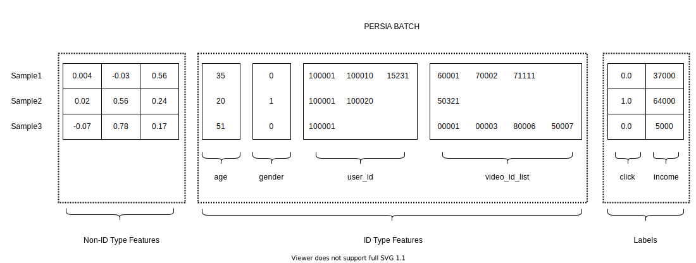

# Data Processing

<!-- To adapt most recommendation scene, the scene that data come from different way, different datatype and shape, PERSIA provides the `PersiaBatch` to resolve this problem. -->

You can use `PersiaBatch` to state a batch of data in various types, shapes and implications.



- [Processing ID Type Features](#id-type-feature)
    - [Variable Length ID Type Feature](#variable-length-id-type-feature)
    - [One Element Length ID Type Feature](#processing-the-one-element-length-id-type-feature)
- [Processing Non-ID Type Feature and Label](#non-id-type-feature-and-label)
- [Processing Meta Data](#processing-meta-data)
- [PersiaBatch Processing Integration Example](#persia-batch-processing-integration-example)

## Processing ID Type Feature

An ID type feature is a sparse matrix that contains variable length of discrete values. PERSIA converts these discrete `id`s to embeddings by looking up from `embedding-worker`. The conversion rules are different for different `id_type_feature`, see [embedding_config](#../configuration/index.md#embedding-config) for more details.

In addition, `PersiaBatch` only accepts  `IDTypeFeatureSparse` or `IDTypeFeature` with the `np.uint64` datatype.

### ID Type Feature with Variable Length

`IDTypeFeature` is 

It is hard to increase the id_type_feature length to inifinitly but always keep the training speed dropdown slightly.The id_type_feature can improve the DNN result significant as the §max_variable_length§ increase.Below code help you understand how to process id_type_feature which has the variable length.

```python
import numpy as np

from persia.embedding.data import PersiaBatch, IDTypeFeatureSparse


id_type_feature_names = [
    "gender", "user_id", "photo_id"
]

gender_data = [
    [0],
    [1],
    [0],
    [0],
    [1]
]

user_id_data = [
    [100001, 100003, 100005, 100020],
    [100001],
    [100001, 200001, 300001],
    [400001, 100001],
    [100001]
]

photo_id_data = [
    [400032, 400031],
    [400032, 400332, 420032, 400332,],
    [400032],
    [], # support empty id_type_feature but still need to add it to keep batch construction
    [400032, 401032, 400732, 460032, 500032]
]

id_type_feature_data = [
    gender_data, user_id_data, photo_id_data
]

batch_size = 5
id_type_features = []

for id_type_feature_idx, id_type_feature_name in enumerate(id_type_feature_names):
    id_type_feature = []
    for batch_idx in range(batch_size):
        id_type_feature.append(
            np.array(
                id_type_feature_data[id_type_feature_idx][batch_idx: batch_idx + 1],
                 dtype=np.uint64
            ).reshape(-1)
        )
    id_type_features.append(
        IDTypeFeatureSparse(id_type_feature_name, id_type_feature)
    )
```

### ID Type Feature with One Element Sample

Almost all public recommendation dataset concat multiple id_type_features in one `numpy.array`. For every id_type_feature it have only one ID for each sample.Below code help you understand how to process such kind of dataset and add the id_type_feature into `PersiaBatch`.

```python
import numpy as np

from persia.embedding.data import PersiaBatch, IDTypeFeature


id_type_feature_names = [
    "gender", "user_id", "photo_id"
]

id_type_feature_data = np.array([
    [0, 100001, 200001],
    [1, 100002, 300002],
    [0, 100003, 400002],
    [0, 100005, 410002],
    [1, 100006, 400032],
], dtype=np.uint64)

batch_size = 5
id_type_features = []

for id_type_feature_idx, id_type_feature_name in enumerate(id_type_feature_names):
    id_type_feature = []
    for batch_idx in range(batch_size):
        id_type_feature.append(
            id_type_feature_data[batch_idx: batch_idx + 1, id_type_feature_idx].reshape(-1)
        )
    id_type_features.append(IDTypeFeature(id_type_feature_name, id_type_feature))
```


## Non-ID Type Feature and Label

Non-ID type features and Labels are tensors with various data type and shape who has the same batch size with `id_type_feature` in a `PersiaBatch`.
<!-- You can use any type of data in `non_id_type_features`, as long as it is supported by [pytorch](https://pytorch.org/docs/stable/tensors.html). -->

<!-- Non-ID type features and Labels can be variable datatype and shape. The restrictions to them is to check the datatype support or not and the batch_size is same as id_type_feature or not.Below code help you understand adding these two type of data. -->

<!-- Non-ID type features is a tensor or vector that contains numerical data. For example the click_num, income, price, labor time or some numerical type data could be concat as the contiguous data and become a part of training data. -->

<!-- `non_id_type_features` support the datatype that [pytorch](https://pytorch.org/docs/stable/tensors.html) support.  -->

The best practice is to concat data with the same type and then append it to `non_id_type_features`, instead of append one by one.
<!-- You can add multiple `non_id_type_feature` with different datatype and different shape. For every Non-ID type_feature, you can concat multiple tensors as one tensor that have same datatype or for more readable reason to add the Non-ID type feature one by one. -->

Datatype supported in `NonIDTypeFeature` and `Label`:

|numpy.dtype|
|-|
|np.bool|
|np.int8|
|np.int16|
|np.int32|
|np.int64|
|np.float32|
|np.float64|
|np.uint8|

Here is an example:

```python
import numpy as np

from persia.embedding.data import NonIDTypeFeature, Label

batch_size = 5

non_id_type_features = []
# add non_id_type_feature
# int8 image_embedding from DNN Extractor
non_id_type_features.append(NonIDTypeFeature(np.ones((batch_size, 256), dtype=np.int8)))
# general statistics such as average income, height, weight
# you can merge the non_id_type_feature together with same datatype
non_id_type_features.append(NonIDTypeFeature(np.eye((batch_size, 3) dtype=np.float32)))
# image_pixel_data or RS data with multiple dimension
non_id_type_features.append(NonIDTypeFeature(np.ones((batch_size, 3, 224, 224), dtype=np.int8)))

labels = []
# add label
# multiple labels classification
labels.append(Label(np.ones((batch_size, 4), dtype=np.bool)))
# regression label
labels.append(Label(np.ones((batch_size), dtype=np.float32)))
```

## Processing Meta Data

`PersiaBatch` provide the meta field to store unstructured data, you can use serialize the object into bytes and add it into `PersiaBatch`.

```python
import json
import pickle

import time 

batch_size = 5
id_type_features = [
    IDTypeFeatureSparse(
        "empty_id_type_feature_with_batch_size", 
        [np.array([], dtype=np.uint64)] * batch_size)
]

meta_info = {
    "batch_id": 100000000,
    "timestamp": time.time()
}

meta_json_bytes = json.dumps(meta_info)
meta_pickle_bytes = pickle.dumps(meta_info)
```


## PersiaBatch Processing Integration Example

<!-- We provide an integration example for you to understand how to generate a `PersiaBatch` from origin data. -->

Here is an example about how to generate a `PersiaBatch` from raw data:

```python 
import json
import time 

import numpy as np

from persia.embedding.data import PersiaBatch, IDTypeFeatureSparse, NonIDTypeFeature, Label

batch_size = 5

id_type_feature_names = [
    "gender", "user_id", "photo_id"
]

gender_data = [
    [0],
    [1],
    [0],
    [0],
    [1]
]

user_id_data = [
    [100001, 100003, 100005, 100020],
    [100001],
    [100001, 200001, 300001],
    [400001, 100001],
    [100001]
]

photo_id_data = [
    [400032, 400031],
    [400032, 400332, 420032, 400332,],
    [400032],
    [], # support empty id_type_feature but still need to add it to keep batch construction
    [400032, 401032, 400732, 460032, 500032]
]

id_type_feature_data = [
    gender_data, user_id_data, photo_id_data
]

id_type_features = []

for id_type_feature_idx, id_type_feature_name in enumerate(id_type_feature_names):
    id_type_feature = []
    for batch_idx in range(batch_size):
        id_type_feature.append(
            np.array(
                id_type_feature_data[id_type_feature_idx][batch_idx: batch_idx + 1], 
                dtype=np.uint64
            ).reshape(-1)
        )
    id_type_features.append(IDTypeFeatureSparse(id_type_feature_name, id_type_feature))


non_id_type_features = []
# add non_id_type_feature
# int8 image_embedding from DNN Extractor
non_id_type_features.append(NonIDTypeFeature(np.ones((batch_size, 256), dtype=np.int8)))
# general statistics such as average income, height, weight
# you can merge the non_id_type_feature together with same datatype
non_id_type_features.append(NonIDTypeFeature(np.eye((batch_size, 3) dtype=np.float32)))
# image_pixel_data or RS data with multiple dimension
non_id_type_features.append(NonIDTypeFeature(np.ones((batch_size, 3, 224, 224), dtype=np.int8)))

labels = []
# add label 
# multiple label classification label
labels.append(Label(np.ones((batch_size, 4), dtype=np.bool), name="ctr_label"))
# regression label
labels.append(Label(np.ones((batch_size), dtype=np.float32), name="income_label"))

meta_info = {
    "batch_id": 100000000,
    "timestamp": time.time()
}

persia_batch = PersiaBatch(
    id_type_features,
    non_id_type_features=non_id_type_features,
    labels=labels,
    requires_grad=True,
    meta=json.dumps(meta_info)
)

```