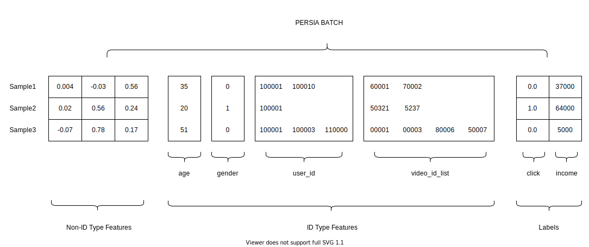

# Customize a PERSIA Job

## TODO: workflow diagram


There are a few files you can customize in PERSIA:

TODO: keep order consistent with the following sections
1. data preprocessing file: xxx.py
2. configuration file: xxxx.yml
3. model definition: train.py
4. ...
5. TODO: Launcher configuration:
    1. If you are using k8s, xxxx.yaml
    2. if your are using docker compose
    3. ...

## Training Data

**PersiaBatch consists of three parts, contiguous data, categorical data and label data.**



TODO: make all naming consistent with paper

### Non-ID Type Features
Non-ID Type Features is a tensor or vector that contains numerical data.For example the click_num, income, price, labor time or some numerical type data could be concat as the contiguous data and become a part of training data.

In PERSIA batch data, it is described as a 2d tensor with float datatype. 


### ID Type Features
ID Type Features is a sparse tensor that contains variable length of discrete value. Such user_id, photo_id, client_id. There should at least exists categorical name and dimension to describe a categorical data.PERSIA parameter server will project the discrete value in categorical data to a vector and the dimension of vector is equal to the value you describe before.It is simple to adding one categorical data in PERSIA, modify the embedding config file and add the categorical name and its dimension.Both `middleware-server` and `embedding-server` will load the embedding config file to apply the categorical data configuration.

In below code, we define three categorical data.For each categorical data the requirement fields are category name and the embedding dimension.

```yml
slot_configs:
  id:
    dim: 8
    embedding_summation: true # optional field
  age:
    dim: 8
  gender:
    dim: 8
```

_more advanced features: embedding_config_chapter.md_

### Labels
Label data in PERSIA batch is a 2d `float32` tensor that support add the classification target and regression target.

### Customize Persia Batch Data

*code example*
```python (data_preprocessing.py)
import numpy as np

from persia.prelude import PyPersiaBatchData

batch_data = PyPersiaBatchData()

# categorical name should be the same with the categorical name which 
# already defined in embedding_config.yml.
categorical_names = [
    "id",
    "age",
    "gender"
]

batch_size = 1024
dim = 256

batch_data.add_dense(np.ones((batch_size, dim), dtype=np.float32))

categorical_data_num = 3
max_categorical_len = 65536

batch_categorical_data = []
for categorical_idx in range(categorical_data_num):
    batch_categorical_data_item = []
    for batch_idx in range(batch_size):
        cnt_categorical_len = np.random.randint(0, max_categorical_len)
        sample_data = np.random.one((cnt_categorical_len), dtype=np.uint64)
        batch_categorical_data_item.append(sample_data)
    batch_categorical_data.append((categorical_names[categorical_idx], batch_sparse_data))

# add mock sparse data into PyPersiaBatchData 
batch_data.add_sparse(batch_categorical_data)
batch_data.add_target(np.ones((1024, 2), dtype=np.float32))
```

more advanced features: ...

- advanced 1 (under construction)

## Model Definition

### Define DNN model
For DNN model definition, you can design any model structure as you wanted.The only restriction is to set the DNN model forward function signature as below form.

```python
from typing import List

import torch

class DNN(nn.Module):
    def forward(self, dense: torch.Tensor, sparse: List[torch.Tensor]):
        ...
```

### Modify Sparse Optimizer
Here provide many sparse optimizer in `persia.sparse.optim` module.You can choose the suitable optimizer to adapt your requirement.

### Customize PersiaML Training Context 
Final step is create the training context to acquire dataloder and sparse embedding process

```python
from torch import nn
from torch.optim import SGD

from persia.ctx import TrainCtx
from persia.data import StreamDataset, Dataloader
from persia.env import get_local_rank
from persia.sparse.optim import Adagrad

prefetch_size = 10
dataset = StreamDataset(prefetch_size)

local_rank = get_local_rank()

use_cuda = True
if use_cuda:
    device_id = get_local_rank()
    torch.cuda.set_device(device_id)
    model.cuda(device_id)
    mixed_precision = True
else:
    mixed_precision = False
    device_id = None

# DNN parameters optimizer
dense_optimizer = SGD(model.parameters(), lr=0.1)
# Embedding parameters optimizer
sparse_optimizer = Adagrad(lr=1e-3)

loss_fn = nn.BCELoss()

with TrainCtx(
    model=model,
    sparse_optimizer=sparse_optimizer,
    dense_optimizer=dense_optimizer,
    device_id=device_id,
    mixed_precision=mixed_precision
) as ctx:

    train_data_loader = Dataloader(dataset)
    for (batch_idx, data) in enumerate(loader):
        output, target = ctx.forward(data)
        loss= loss_fn(output, target)
        scaled_loss = ctx.backward(loss)
        logger.info(f"current idx: {batch_idx} loss: {loss}")

```

more advanced features: ..

## Configuring Embedding Servers

Embedding servers include middleware server and parameter server.

A embedding middleware server runs asynchronous updating algorithm for getting the embedding parameters from the embedding parameter server; aggregating embedding vectors (potentially) and putting embedding gradients back to embedding parameter server. You can learn the details of the system design through 4.2 section in our [paper](https://arxiv.org/abs/2111.05897). Generally, you only need to adjust the number of instances and resources according to your workload.

A embedding parameter server manages the storage and update of the embedding parameters according to [LRU](https://en.wikipedia.org/wiki/Cache_replacement_policies#Least_recently_used_(LRU)) policies. So you need to configure capacity of the LRU cache in the configuration file according to your workload and available memory size. In addition, the capacity means the max number of embedding vectors, not the number of parameters.

more advanced features: See [Configuration](../configuration/index.md)

## Model Checkpointing

You can call `load_checkpoint` or `dump_checkpoint` in a persia context, both the dense part and the sparse part will be saved into `checkpoint_dir`. The model will be saved to the local path by default, when the path start with `hdfs://`, it will be saved to hdfs path.

```python
with TrainCtx(
    model=model,
    sparse_optimizer=sparse_optimizer,
    dense_optimizer=dense_optimizer,
    device_id=device_id,
    embedding_config=embedding_config,
) as ctx:
    ctx.load_checkpoint(checkpoint_dir)
    if batch_idx % 10000 == 0:
        ctx.dump_checkpoint(checkpoint_dir)
```

more advanced features: See [Model Checkpointing](../model-checkpointing/index.md)

## Distributed Task

The Persia Operator is a Kubernetes [custom resource definitions](https://kubernetes.io/docs/tasks/extend-kubernetes/custom-resources/custom-resource-definitions/). You can define your distributed persia task by an operator file.

Here is an example for an operator file

```yaml
apiVersion: persia.com/v1
kind: PersiaJob
metadata:
  name: adult-income  # persia job name, need to be globally unique
  namespace: default  # k8s namespace to deploy to this job
spec:
  # the following path are the path inside the container
  globalConfigPath: /workspace/config/global_config_train.yml
  embeddingConfigPath: /workspace/config/embedding_config.yml
  trainerPyEntryPath: /workspace/train.py
  dataLoaderPyEntryPath: /workspace/data_compose.py
  # k8s volumes definition, see https://kubernetes.io/docs/concepts/storage/volumes/
  volumes:
    - name: workspace
      hostPath:
        path: /nfs/general/PersiaML/e2e/adult_income/
        type: Directory
  # global env, it will apply to all containers.
  env:
    - name: PERSIA_NATS_IP
      value: nats://persia-nats-service:4222

  # embedding server configurations.
  embeddingServer:
    replicas: 1  # num of instance
    resources:   # resources of containers, see https://kubernetes.io/docs/concepts/configuration/manage-resources-containers/
      limits:
        memory: "24Gi"
        cpu: "4"
    volumeMounts:  # volume mounts of containers, see https://kubernetes.io/docs/concepts/storage/volumes/
      - name: workspace
        mountPath: /workspace/

  # middleware server configurations.
  middlewareServer:
    replicas: 1
    resources:
      limits:
        memory: "24Gi"
        cpu: "4"
    volumeMounts:
      - name: workspace
        mountPath: /workspace/

  # trainer configurations.
  trainer:
    replicas: 1
    nprocPerNode: 1
    resources:
      limits:
        memory: "24Gi"
        cpu: "12"
        nvidia.com/gpu: "1"
    volumeMounts:
      - name: workspace
        mountPath: /workspace/
    env:
      - name: CUBLAS_WORKSPACE_CONFIG
        value: :4096:8

  # dataloader configurations.
  dataloader:
    replicas: 1
    resources:
      limits:
        memory: "8Gi"
        cpu: "1"
    volumeMounts:
      - name: workspace
        mountPath: /workspace/

---
# a nats operator
apiVersion: "nats.io/v1alpha2"
kind: "NatsCluster"
metadata:
  name: "persia-nats-service"
spec:
  size: 1
  natsConfig:
    maxPayload: 52428800
  resources:
    limits:
      memory: "8Gi"
      cpu: "2" 
```

## Deployment for inference

see #Deployment for inference


